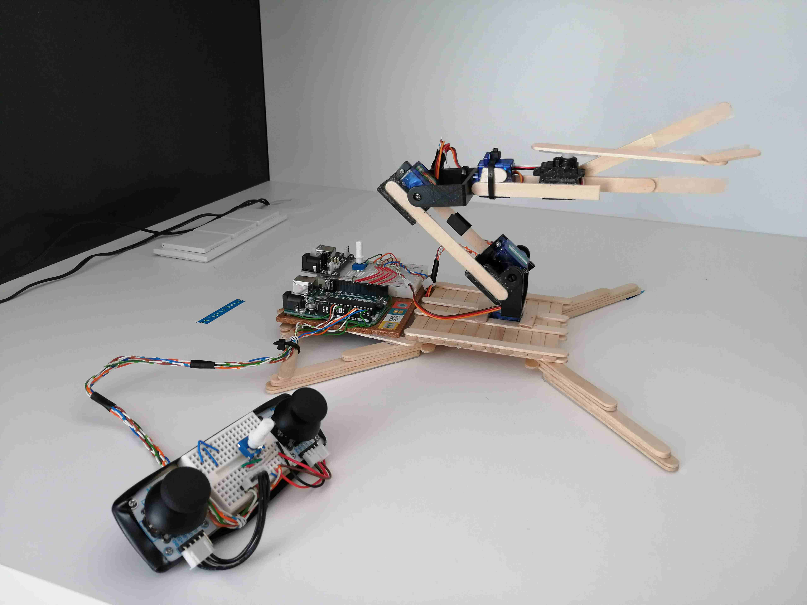

# 4 Axis robotic arm controlled with Joysticks
Robotic arm using Arduino UNO, servo motors and Joysticks.

  

This repo contains the code and some resources to build a very simple robotic arm controlled by 2 Joysticks.

**Elements**
---
The needed elements were:
1. Arduino UNO R3
2. 5 Mini Servo motors SG90
3. 2 Joysticks modules
4. 2 Potentiometers
5. 1 Power supply module
6. 1 Medium Breadboard (for the arm)
7. 1 Small Breadboard (for controller)
8. 100 wooden tongue blades (11 cm x 1 cm)
9. 1 regular UHU 35g tube
10. Some UTP CAT 5 cable

It is fair to mention that I cheated and used some parts of another Arduino project for the articulations. However, with a small drill and some nuts and bolts it is also possible to do a pretty good job. The making of this Job took around a week.

  

It is not hard to build the arm and program it, Therefore, some photos of it (and read of the code) will make the job of a proper circuit diagram (lack of time). So, don’t forget to take a look into the images!

If you want to see the arm in action, just take a look to the <a href="https://youtu.be/bT3EbzHVtbY">YouTube Video!</a>

I hope that this information will help you in your project, so have fun!
